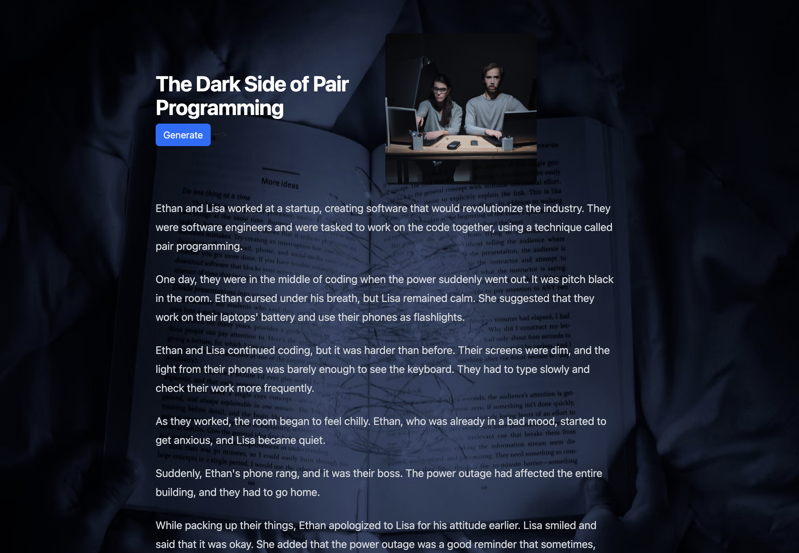
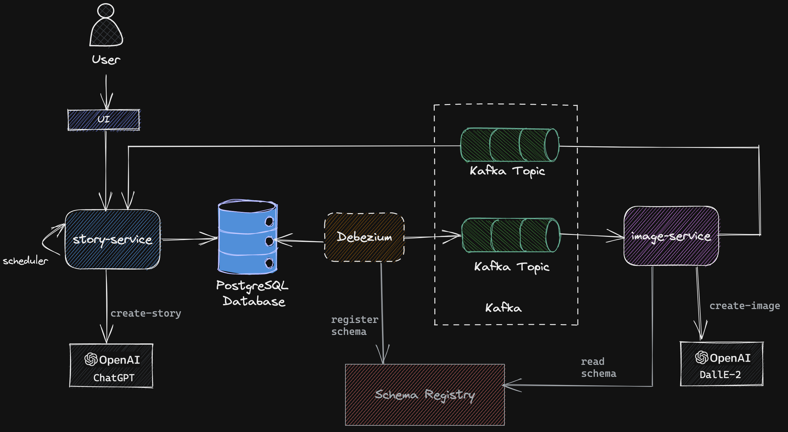
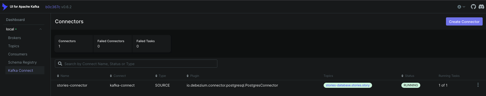

# AI Story Teller using Spring Boot, ChatGPT and DALL-E 🤖

An event driven application that generates a new bedtime story for children every night using Spring Boot, PostgresSQL, Kafka, Debezium, [ChatGPT](https://chat.openai.com/) and [DALL-E ](https://labs.openai.com/). This repo is an inspiration from the [aws-serverless-ai-stories](https://github.com/aws-samples/aws-serverless-ai-stories) project



### How it works
<hr/>

- `story-service` includes a scheduled job that calls [ChatGPT](https://chat.openai.com/) to generate a new story based on a specified scene and characters. For demonstration purpose, the UI also has a 'Generate' button to initiate a new story flow outside the scheduled job. The generated story is inserted into a PostgresSQL database.
- Source connectors monitor change of records in PostgresSQL and push database change events to Kafka
- `image-service` listens to change events and calls [DALL-E ](https://labs.openai.com/)to generate image. The URL returned from DALL-E is published to a separate Kafka topic
- `story-service` reads the image url and stores it against the corresponding story. Frontend displays the generated story and the image.




### Project Structure 
<hr/>

The codebase loosely follows the [application continuum](https://www.appcontinuum.io/) programming style. It consists of 3 top level directories - applications, components and databases


```
|-- applications
|   |-- images-app
|   |-- stories-app
|   |-- pom.xml
|-- components
|   |-- images
|   |-- stories
|   |-- pom.xml
|-- databases
|   |-- stories-database
```

The [applications](./applications) module contains deployable artefacts and their configuration. Applications are designed and modelled around a single [bounded context](https://martinfowler.com/bliki/BoundedContext.html).  
Each application contains little more than 
- A Spring Boot application class
- Spring REST controllers
- Message Consumers
- Application specific configuration

Each application depends on one more [components](./components) which are loosely coupled and highly cohesive.
A typical components consists of

- Services
- Business Logic
- Data Gateways
- Support Libraries

Support libraries, suffixed with _*-support_, contain code related to a specific function and avoid any business logic.

The [databases](./databases) directory consists of the data store implementation per microservice. Each data store implementation may consist of the database SQL schema depending on the choice of database technology used.

### Applications
<hr/>

#### `story-service`

Spring boot service is the core that manages all aspects around stories. Includes a minimal front end to display the generated image and text. 

#### `image -service`

Spring boot service that listens for messages containing a story scene and invokes the OpenAI endpoint to generate an image for that scene. It then publishes the URL of the image to Kafka to be read by the story-service 

### Prerequisites

- [Docker](https://www.docker.com/)
- [Java 17+](https://www.oracle.com/java/technologies/downloads/#java17)
- [Docker Compose](https://docs.docker.com/compose/install/)

### Starting Docker containers
<hr/>

- From the root of the project, run the following command
    ```bash
    docker compose up -d
    ```
  This will start the Postgres database, Kafka, Zookeeper, Confluent Schema Registry, Kafka UI docker containers
- Wait for all docker containers to be up and running. Check using,
    ```bash
    docker compose ps
    ```

### Run `stories-app`
<hr/>

- Open a new terminal windows and from the root of the project

  ```bash
  ./mvnw clean install
  ```

- Define the environment variable
  ```bash
  export OPENAI-API-KEY=<your-openai-api-key>
  ```

- Run the `story-serivce`
  ```bash
  ./mvnw spring-boot:run --projects applications/stories-app
  ```
  
### Adding connector configuration
<hr/>

From the project root folder

- Run the following `curl` commands to create `Debezium` connectors in `kafka-connect`

    ```bash
      curl -i -X POST localhost:8083/connectors -H 'Content-Type: application/json' -d @connectors/stories-connector.json
    ```

- Check the status of the connector by calling `kafka-connect` endpoint

    ```bash
    curl localhost:8083/connectors/stories-connector/status
    ```

Alternatively you can access the [Kafka-UI](http://localhost:8087)



- The state of the connectors and their tasks must be RUNNING. If there is any problem, you can check kafka-connect container logs.

    ```bash
    docker logs kafka-connect
    ```


  
### Run `images-app`
<hr/>

- Define the environment variable
  ```bash
  export OPENAI-API-KEY=<your-openai-api-key>
  ```

- Run the `story-serivce`
  ```bash
  ./mvnw spring-boot:run --projects applications/images-app
  ```
  
Access the application at http://localhost:9090